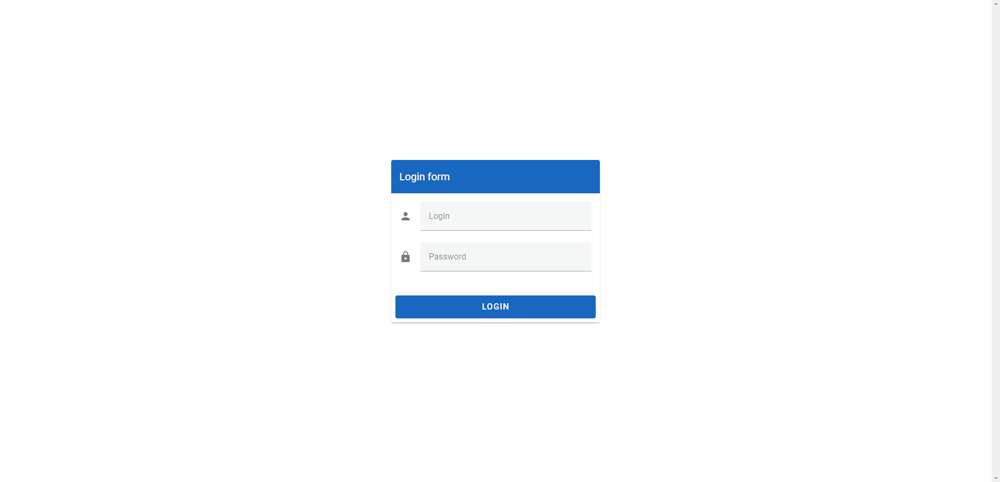

# Example login

This example uses:
- vue router
- pinia
- vuetify

And create a simple dummy form for login, a navigation drawer that includes two routes and logout button



## Project setup

```
yarn
```

### Compiles and hot-reloads for development

```
yarn dev
```

### Compiles and minifies for production

```
yarn build
```


